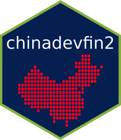

<!-- README.md is generated from README.Rmd. Please edit that file -->


```{r, include = FALSE}
knitr::opts_chunk$set(
  collapse = TRUE,
  comment = "#>",
  fig.path = "man/figures/README-",
  out.width = "100%"
)
```

# chinadevfin2 <a href="https://t-emery.github.io/chinadevfin2/"></a>


<!-- badges: start -->
[](https://github.com/t-emery/chinadevfin2/actions/workflows/R-CMD-check.yaml)
[](https://lifecycle.r-lib.org/articles/stages.html#experimental)
<!-- badges: end -->

`chinadevfin2` is primarily a data package enabling an efficient method for working with [AidData's](https://www.aiddata.org/) [Global Chinese Development Finance Dataset, Version 2.0](https://www.aiddata.org/data/aiddatas-global-chinese-development-finance-dataset-version-2-0) (GCDF 2.0) in R. 

### About the GCDF 2.0 dataset:

[AidData's](https://www.aiddata.org/data/aiddatas-global-chinese-development-finance-dataset-version-2-0) summary of the dataset:

> AidData’s Global Chinese Development Finance Dataset, Version 2.0. records the known universe of projects (with development, commercial, or representational intent) supported by official financial and in-kind commitments (or pledges) from China from 2000-2017, with implementation details covering a 22-year period (2000-2021). The dataset captures 13,427 projects worth $843 billion financed by more than 300 Chinese government institutions and state-owned entities across 165 countries in every major region of the world. AidData systematically collected and quality-assured all projects in the dataset using the [2.0 version of our Tracking Underreported Financial Flows (TUFF) methodology](https://www.aiddata.org/publications/aiddata-tuff-methodology-version-2-0).

Please see the [AidData's](https://www.aiddata.org/data/aiddatas-global-chinese-development-finance-dataset-version-2-0) dataset website for full citation details.   

If you are unfamiliar with the dataset, the following resources are a great place to start:

* **AidData - Policy Report**: [Banking on the Belt and Road: Insights from a new global dataset of 13,427 Chinese development projects](https://www.aiddata.org/publications/banking-on-the-belt-and-road)
* **AidData - Methodology**: [Tracking Underreported Financial Flows (TUFF) methodology, 2.0](https://www.aiddata.org/publications/aiddata-tuff-methodology-version-2-0).
* **AidData - Dataset Website**: [Global Chinese Development Finance Dataset, Version 2.0](https://www.aiddata.org/data/aiddatas-global-chinese-development-finance-dataset-version-2-0) 

### Relevant Notes

1. **`chinadevfin2` is still under heavy development**: Please use accordingly. The initial phase of package development aims to finalize stable versions of the datasets, and will be announced with a new package version release and note. Further development will focus on building helper functions to aid efficient analysis workflows with the dataset. 
2. **`chinadevfin2` is a personal project**:  While the package author works as a [consultant to AidData](https://www.linkedin.com/feed/update/urn:li:activity:7067478837885849600/) this package is a personal project with no official affiliation or sponsorship from AidData. The author built the package for his own own use, but hopes that it can grow into a robust package that can aid researchers, policymakers, and others interested in gaining actionable, empirically-based insights about Chinese development finance lending using the GCDF 2.0 dataset. 


## Installation

You can install the development version of chinadevfin2 from [GitHub](https://github.com/) with:

``` r
# install the `devtools` package if not yet installed
# install.packages("devtools")

# install chinadevfin2 from GitHub
devtools::install_github("t-emery/chinadevfin2")
```

This package will likely never be published on [CRAN](https://cran.r-project.org/) because the data file sizes are too big.

## Example


The core initial functionality of `chinadevfin2` is to load the GCDF 2.0 dataset as a `tibble` using `get_gcdf2_dataset()`:

```{r example}
# load the chinadevfin2 library
library(chinadevfin2)
library(tidyverse)

# Load the GCDF 2.0 dataset as a tibble, with standardized country names added at the beginning.
get_gcdf2_dataset()
```

`gcdf2_data_dictionary` contains AidData's detailed data definitions for all of the GCDF 2.0 variables:

```{r example 2}
# Load the GCDF 2.0 data dictionary as a tibble
gcdf2_data_dictionary
```

This makes it easy to find actionable insights quickly.  Let's look at the growth of concessional versus non-concessional lending in the years covered by the dataset (2000-2017).

```{r}

concessional_vs_non_concenssional <- get_gcdf2_dataset() |> 
  # See `recommended_for_aggregates` in the gcdf2_data_dictionary to learn more about this. 
  filter(recommended_for_aggregates == "Yes") |> 
  # Group by the commitment year and whether the loand is concessional
  group_by(commitment_year, concessional) |> 
  # Find the sum by year and concessionality type in constant 2017 USD
  summarize(commitments = sum(amount_constant_usd2017, na.rm = TRUE)) |> 
  # ungroup to avoid strange side effects of grouped tibbles
  ungroup() |> 
  # make prettier names for a chart or table
  mutate(label_for_chart = case_when(concessional=="Yes" ~ "Concessional",
                                     concessional=="No" ~ "Non-Concessional",
                                     concessional=="Vague" ~ "Unclear",
                                     ))

concessional_vs_non_concenssional
```

Now we can use `ggplot2` to make a data visualization:

```{r}
concessional_vs_non_concenssional |> 
  ggplot(aes(x = commitment_year, y = commitments, fill = label_for_chart)) +
  geom_bar(stat = "identity") +
  scale_fill_brewer(palette = "Blues") +
  theme_minimal(base_size = 14) +
  scale_y_continuous(labels = scales::label_dollar(suffix = " bn", scale = 1/10^9, accuracy = 1)) +
  labs(title = "Chinese Development Finance Loan Commitments",
       subtitle = "chinadevfin2: from ideas to actionable insights, quickly",
       x = "Commitment Year",
       y = "Commitments (2017 Constant USD)",
       fill = "",
       caption = "Data: AidData's Global Chinese Development Finance Dataset, 2.0\nUsing the chinadevfin2 R package") +
  theme(legend.position="top")
```


